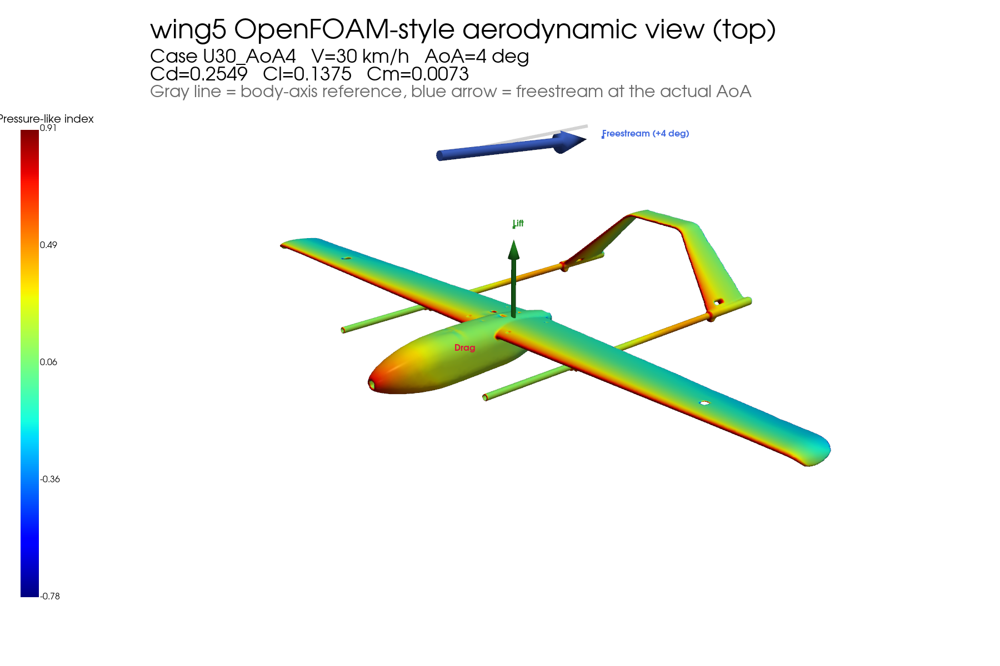

# wing5 front-curve visualization bundle

GitHub 업로드용으로 정리한 묶음입니다.
수정된 OpenFOAM 결과(`wing5_uav_rerun_v2_signfix`)와 `01_light_front_curve` 시각화, baseline 이미지, 재현 스크립트를 같이 넣었습니다.




## Main case
- OpenFOAM result set: `wing5_uav_rerun_v2_signfix`
- Visualization target: `U30_AoA4`
- Speed: `30 km/h`
- AoA: `4 deg`
- Cd: `0.254854`
- Cl: `0.137511`
- CmPitch: `0.007308`

## Folder structure
```text
images/
data/
scripts/
README.md
```

## Included files

### images/
- `01_light_front_curve.png`
  - 메인 front-facing streamline 이미지
- `02_light_front_curve_close.png`
  - 기수 쪽 close-up variant
- `front_curve_contact_sheet.jpg`
  - 위 두 장 비교 시트
- `baseline_no_streamline.png`
  - dense streamline이 없는 baseline aerodynamic render
- `01_light_reference.png`
  - density ladder의 `01_light` 원본 레퍼런스
- `density_ladder_contact_sheet.jpg`
  - light / normal / heavy / very heavy 비교 시트

### data/
- `U30_AoA4_case_summary.md`
  - 핵심 케이스 요약
- `coefficients_sweep_smoothed.csv`
  - CFD sweep coefficient table
- `stage2_aero_table.csv`
  - stage-2 aerodynamic table
- `stage2_gazebo_params.yaml`
  - Gazebo용 parameter export
- `stage2_notes.txt`
  - stage-2 processing notes

### scripts/
- `render_wing5_openfoam_style.py`
  - baseline no-streamline render
- `render_wing5_paraview_density_ladder.py`
  - density ladder renderer
- `render_wing5_paraview_light_front_curve.py`
  - front-facing light streamline renderer

## Suggested GitHub commit message
```text
Add wing5 U30_AoA4 front-curve CFD visualization bundle
```

## Reproduction
원본 CFD 데이터가 같은 위치에 있다면 아래 명령으로 재생성할 수 있습니다.

```bash
xvfb-run -a pvbatch scripts/render_wing5_paraview_light_front_curve.py
xvfb-run -a pvbatch scripts/render_wing5_paraview_density_ladder.py
python3 scripts/render_wing5_openfoam_style.py --case U30_AoA4 --view top
```

## Important note
- streamline 이미지는 ParaView 후처리 결과입니다.
- baseline 이미지는 streamline을 추가하지 않은 깨끗한 비교용 이미지입니다.
- 두 이미지는 모두 같은 프로젝트 컨텍스트에서 만든 발표용/문서용 산출물입니다.
